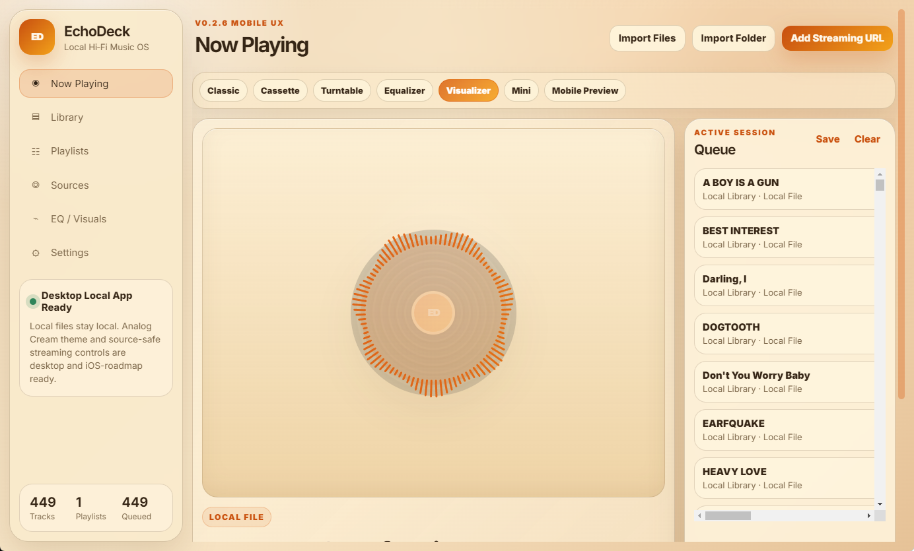

# EchoDeck

**EchoDeck** is a local-first Hi-Fi Music OS for desktop, with a growing iOS app scaffold. It is designed for local music playback, playlists, queues, visualizers, deck-style player modes, and source-aware streaming embeds.



## Current Release

**v0.3.2 — README + Screenshot Repo Polish**

This release updates the repository README, adds a live EchoDeck screenshot, keeps the v0.3.x iOS scaffold path, and preserves the Windows/macOS desktop workflow.

## Highlights

- Local-first desktop music player
- Windows 11 desktop build support
- macOS desktop source support
- iOS Capacitor scaffold started in v0.3.0
- Local file import and folder import
- Queue and playlist management
- Source-aware streaming URL support
- YouTube and SoundCloud embed-oriented workflow
- Multiple deck modes and full-screen visualizer
- Theme Gallery, Demo Mode, recently played persistence, duplicate scan, and release tools

## Themes

| Theme | Best Use |
|---|---|
| Analog Cream | Warm retro Hi-Fi / mobile deck |
| Studio White | Clean LCD / tape lab style |
| Modern Dark | Desktop visualizer and dark UI |
| Modern Light | Clean workspace |
| Vintage Receiver | Retro stereo dashboard |
| Cassette Deck | Tape / mixtape feel |

## Deck Modes

- Classic
- Cassette
- Turntable
- Equalizer
- Visualizer
- Mini Player
- Mobile Preview

Keyboard shortcuts:

| Key | Action |
|---|---|
| `D` | Cycle deck modes |
| `M` | Toggle Mobile Preview |
| `F` | Open full-screen visualizer |

## Screenshots

More screenshots can be added under:

```text
docs/screenshots/
```

Recommended screenshot set:

```text
docs/screenshots/echodeck-analog-cream-now-playing-v0.3.1.png
docs/screenshots/studio-white-mobile.png
docs/screenshots/modern-dark-visualizer.png
docs/screenshots/theme-gallery.png
docs/screenshots/streaming-sources.png
docs/screenshots/library-demo.png
```

## Install and Run on Windows

```powershell
cd C:\docker\EchoDeck

npm install
npm run lint:smoke
npm start
```

## Build Windows Installer and Portable EXE

```powershell
cd C:\docker\EchoDeck

Remove-Item -Recurse -Force release -ErrorAction SilentlyContinue
npm run package:win
```

Expected outputs:

```text
release\EchoDeck-0.3.2-Windows-Setup.exe
release\EchoDeck-0.3.2-Windows-Portable.exe
```

## Publish GitHub Release

```powershell
git status
git add .
git commit -m "Update README and screenshots for EchoDeck v0.3.2"
git push

gh release create v0.3.2 `
  --repo echofoxx/echodeck `
  --title "EchoDeck v0.3.2" `
  --notes-file RELEASE_NOTES_v0.3.2.md `
  release\EchoDeck-0.3.2-Windows-Setup.exe `
  release\EchoDeck-0.3.2-Windows-Portable.exe
```

## iOS Scaffold Status

EchoDeck v0.3.0 introduced the iOS Capacitor scaffold. The iOS app is not yet App Store-ready, but the repository now includes the first iOS path.

On Windows:

```powershell
npm run ios:doctor
npm run ios:prepare
```

On macOS with Xcode:

```bash
npm install
npm run ios:doctor
npm run ios:prepare
npm run ios:add
npm run ios:sync
npm run ios:open
```

See:

```text
docs/IOS_SETUP_v0.3.0.md
docs/IOS_XCODE_BUILD_v0.3.0.md
docs/IOS_LOCAL_FILE_IMPORT_PLAN_v0.3.0.md
docs/IOS_APP_STORE_NOTES_v0.3.0.md
```

## Streaming Compliance Notes

EchoDeck is source-aware. It should use official embed/API/SDK paths and should not rip protected streams, convert YouTube videos to MP3, bypass ads, cache protected streaming audio, hide required streaming platform players, or re-host protected music.

Local files remain the most flexible source for EQ, visualizers, queue control, and future offline workflows.

## Project Structure

```text
EchoDeck/
├─ apps/
│  ├─ desktop/
│  ├─ ios/
│  └─ web/
├─ packages/
│  ├─ shared/
│  ├─ player-core/
│  ├─ themes/
│  └─ visualizers/
├─ src/
│  ├─ main.js
│  ├─ preload.js
│  └─ renderer/
├─ docs/
│  └─ screenshots/
├─ scripts/
├─ package.json
└─ capacitor.config.json
```

## Roadmap

| Version | Focus |
|---|---|
| v0.3.2 | README and screenshot repo polish |
| v0.3.3 | Screenshot gallery and release media cleanup |
| v0.4.0 | iOS local file import |
| v0.4.1 | iOS player controls polish |
| v0.5.0 | Apple Music path |
| v0.6.0 | Spotify path |
| v0.7.0 | Local AI playlist builder |

## License

MIT
